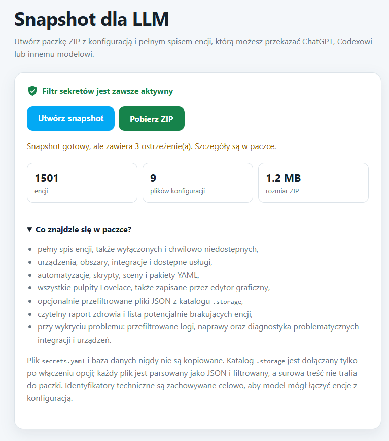

# HA LLM Snapshot Exporter

**Give ChatGPT, Codex, Claude, Gemini or another LLM the technical context it actually needs to analyze your Home Assistant installation.**

HA LLM Snapshot Exporter is a Home Assistant add-on that creates a privacy-filtered ZIP snapshot of your Home Assistant configuration, entities, devices, integrations, automations, dashboards and diagnostics.

Instead of copying configuration files manually or explaining your setup piece by piece, create one snapshot and upload it to the LLM you want to use.

<p align="center">
  
</p>

## Why use it?

When troubleshooting Home Assistant with an AI assistant, the biggest problem is usually missing context.

An LLM may need to know:

- which entities actually exist;
- which entities are unavailable or disabled;
- how devices and integrations are connected;
- which automations reference which entities;
- whether an automation references something that no longer exists;
- whether automation IDs are duplicated;
- what Lovelace dashboards contain;
- whether an integration or device is reporting errors;
- what the current Home Assistant configuration looks like.

HA LLM Snapshot Exporter collects this information automatically and packages it into a structured archive designed for analysis by an LLM.

## Quick start

1. Open **Home Assistant**.
2. Go to **Settings → Add-ons → Add-on Store**.
3. Open the **⋮ menu** in the upper-right corner.
4. Select **Repositories**.
5. Add:

```text
https://github.com/infoprojektps-web/ha-llm-snapshot
```

6. Install **HA LLM Snapshot Exporter**.
7. Start the add-on.
8. Enable **Show in sidebar**.
9. Open **LLM Snapshot**.
10. Select **Create snapshot**.
11. Download the generated ZIP.
12. Upload the ZIP to ChatGPT, Codex, Claude, Gemini or another LLM.

That's it.

---

## What the snapshot contains

The exporter can collect:

- complete Home Assistant entity inventory;
- current entity states and attributes;
- disabled, hidden and temporarily unavailable entities;
- devices;
- areas;
- floors;
- labels;
- integrations;
- Home Assistant services/actions;
- automations;
- scripts;
- scenes;
- packages;
- blueprints;
- YAML configuration;
- Lovelace dashboards;
- dashboards created in the Home Assistant UI;
- Lovelace resources;
- entity and service dependency references;
- missing entity references;
- duplicate automation IDs;
- repeated YAML automation blocks;
- integration and device availability information;
- Home Assistant repair issues;
- selected system log entries;
- targeted integration diagnostics;
- targeted device diagnostics;
- SHA-256 file manifest.

The generated snapshot also contains a human-readable health report.

---

## HEALTH_REPORT.md

One of the most useful files in the archive is:

```text
HEALTH_REPORT.md
```

It provides a prioritized overview of potential problems detected in the Home Assistant installation.

Depending on the installation, it can identify issues such as:

- unavailable entities;
- integrations reporting problems;
- groups of unavailable entities belonging to the same device or integration;
- automations depending on unavailable entities;
- references to entities that appear to be missing;
- duplicate automation IDs;
- repeated automation definitions;
- Home Assistant repair issues;
- relevant update information.

A structured version is also available as:

```text
health-report.json
```

---

## Recommended prompt

After uploading the generated ZIP to an LLM, you can start with:

```text
Analyze this Home Assistant snapshot.

Start with HEALTH_REPORT.md and health-report.json.

Then inspect the snapshot for:

- unavailable or broken devices and integrations,
- automations referencing missing or unavailable entities,
- duplicate or suspicious automations,
- configuration problems,
- problems visible in Home Assistant repairs and diagnostics.

Prioritize the most important findings first.

Explain each problem in plain language and suggest safe fixes.

Do not assume that every unavailable entity should simply be deleted.
Use the entity, device, integration and automation relationships contained
in the snapshot before recommending changes.
```

For more detailed analysis, the recommended reading order is:

1. `HEALTH_REPORT.md`
2. `health-report.json`
3. `snapshot-info.json`
4. `diagnostics.json`
5. `additional-diagnostics.json`
6. `entities_all.jsonl`
7. `references.json`
8. files under `config/`

---

# Privacy and security

Privacy is a core part of the exporter.

## Never exported

The add-on does not copy:

- `secrets.yaml`;
- Home Assistant databases;
- authentication databases;
- backups;
- media files.

## `.storage`

The `.storage` directory is **not exported by default**.

An optional configuration setting can include selected `.storage` information for deeper analysis.

When enabled:

- every source file must contain valid JSON;
- its contents are recursively filtered;
- raw `.storage` files are never copied directly;
- the filtered result is written into the snapshot.

The option is disabled by default.

## Credential filtering

The exporter automatically filters common sensitive credentials, including:

- passwords;
- access tokens;
- API keys;
- authorization headers;
- cookies;
- webhook identifiers;
- PINs;
- private keys;
- credentials embedded in URLs.

Credential filtering is always applied.

## Technical identifiers

Some technical identifiers are intentionally preserved because they are useful for diagnosing Home Assistant relationships.

These may include:

- entity IDs;
- device IDs;
- integration identifiers;
- local IP addresses;
- MAC addresses;
- serial numbers;
- VINs.

Removing all of these identifiers would make many device and automation relationships impossible for an LLM to analyze correctly.

## Location information

Location redaction is available as a separate option.

It is disabled by default because location information can sometimes be important when analyzing zones, presence detection, device trackers and automations.

Enable it if you do not need location-related analysis.

## Important

Automatic filtering cannot recognize every piece of personal information that a user may have entered into:

- entity names;
- aliases;
- automation descriptions;
- device names;
- log messages;
- dashboard text.

**Always review the generated archive before uploading it to an external service.**

---

# Read-only Home Assistant access

The Home Assistant configuration directory is mounted by the add-on as **read-only**.

The exporter reads the configuration but does not modify it.

Generated snapshot archives are written only to:

```text
/share/ha-llm-snapshots/
```

Using the snapshot with an external LLM does **not** give that LLM direct access to your Home Assistant installation.

The snapshot is a static export that you choose to download and upload manually.

---

# Lovelace dashboards

Version 0.3.0 adds comprehensive dashboard export.

The exporter can collect Lovelace dashboards through Home Assistant's read-only API, including dashboards created using the graphical UI and stored internally by Home Assistant.

It also exports Lovelace resources.

This allows an LLM to analyze not only YAML configuration but also dashboards that would otherwise be invisible in a simple configuration-directory export.

---

# Extended diagnostics

Extended diagnostics are enabled by default.

If the exporter detects an unavailable entity or an integration reporting an error, it can attempt to collect additional context for the most relevant devices and integrations.

This may include:

- Home Assistant repairs;
- selected system log entries;
- integration diagnostics;
- device diagnostics.

Diagnostic collection is best-effort.

If a particular Home Assistant version or integration does not provide a diagnostic endpoint, the error is recorded in the snapshot and ZIP creation continues.

A missing diagnostic endpoint will not prevent the snapshot from being generated.

---

# Configuration

Available options include:

| Option | Description |
|---|---|
| `include_states` | Include current entity states |
| `include_services` | Include Home Assistant services/actions |
| `include_packages` | Include Home Assistant packages |
| `include_dashboards` | Include Lovelace dashboards |
| `include_storage` | Include privacy-filtered `.storage` JSON data |
| `include_diagnostics` | Enable extended diagnostic collection |
| `redact_locations` | Redact location-related information |
| `keep_snapshots` | Number of generated snapshots to retain |

`include_storage` is disabled by default.

---

# Main files in the ZIP

A snapshot normally contains files such as:

```text
HEALTH_REPORT.md
health-report.json
snapshot-info.json
diagnostics.json
additional-diagnostics.json
entities_all.jsonl
states.jsonl
devices.json
areas.json
floors.json
labels.json
integrations.json
services.json
references.json
manifest.json
```

It can also contain sanitized configuration files, Lovelace dashboard data and optional filtered `.storage` information.

---

# Who is this for?

The add-on is useful if you:

- troubleshoot Home Assistant with ChatGPT or another LLM;
- have a large installation that is difficult to describe manually;
- want help analyzing automations;
- want to find broken entity references;
- are migrating or cleaning up an older Home Assistant installation;
- have unavailable devices and want to understand why;
- want an LLM to understand relationships between your entities, devices and automations;
- want to provide Home Assistant context to an AI without giving it direct control over your installation.

You do **not** need to be a developer to use it.

---

# Project status

The project is currently experimental.

Home Assistant changes frequently and individual integrations expose different levels of diagnostic information.

If you encounter a problem, unexpected snapshot content or an integration that cannot be diagnosed correctly, please open an issue.

Feedback is very welcome.

---

# License

MIT License.

---

## Support the project

If HA LLM Snapshot Exporter helped you diagnose your Home Assistant installation, consider giving the repository a ⭐.

Bug reports, suggestions and pull requests are welcome.
